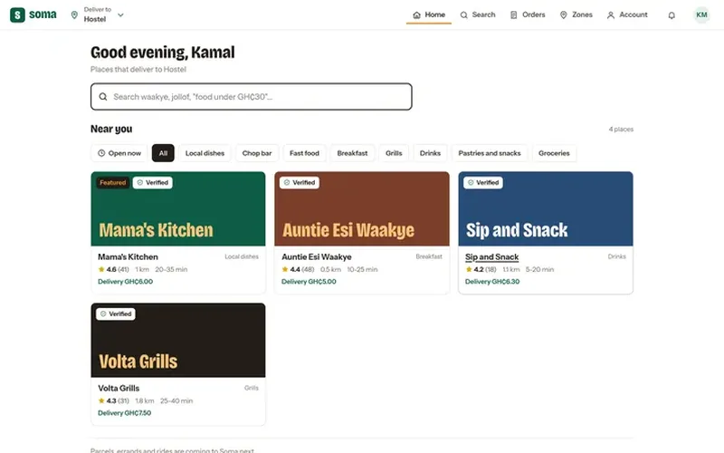
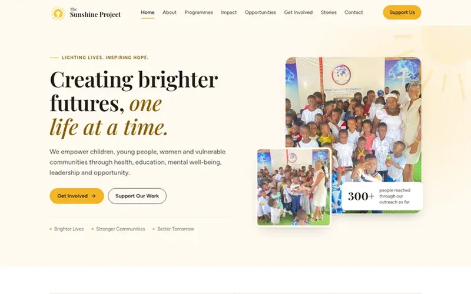
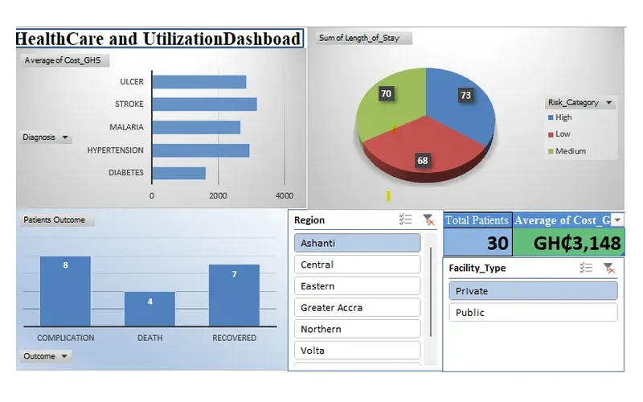
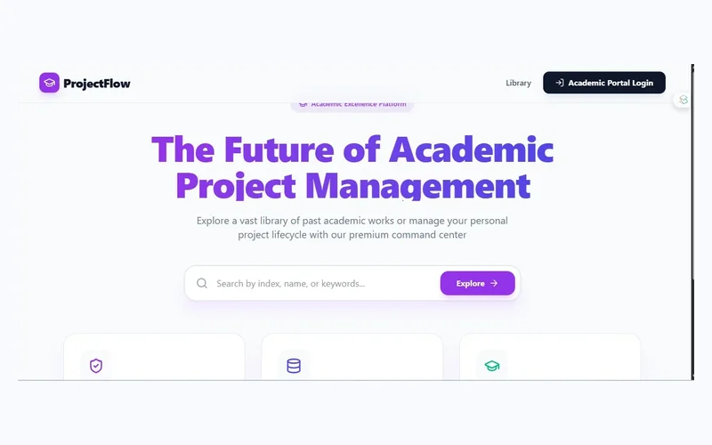

  
  
  
  
  

 

I'm **Amadu Kamal**, a data analyst and software engineer from Ghana and the founder of **[Model Analysis Hub](https://modelanalysishub.com)**.

I work in the gap between good analysis and real decisions. Too often a careful model stays in a report while the decision is made from a spreadsheet. So I build both halves: the statistics you can defend in front of reviewers, and the software that puts the result in front of the people who use it.

> **My standard is short:** the numbers have to be right, and someone has to use the result.

 

 

## What I do

 

## Selected work

<table>
  <tr>
    <td width="50%" valign="top">
      
      <h3>QuantAI</h3>
      <b>OWN PRODUCT · 2026</b>
      
A free research and statistics assistant. Upload a spreadsheet and ask in plain English: it checks the data, picks each test from assumption checks, fits regression and survival models, and exports every analysis as <b>Stata, Python, R and SPSS</b> code. All numbers are verified against SciPy and statsmodels.

      <a href="https://modelanalysishub.com/ai.html"><b>Open QuantAI →</b></a>
    </td>
    <td width="50%" valign="top">
      
      <h3>Soma</h3>
      <b>OWN PRODUCT · FOOD DELIVERY · 2026</b>
      
A local food delivery platform for the Volta Region: customer, vendor, rider and admin apps in one. Mobile Money and card payments through Paystack with automatic payouts, PIN-confirmed delivery and an installable web app.

      <a href="https://modelanalysishub.com/projects.html#soma"><b>Case study →</b></a>
    </td>
  </tr>
  <tr>
    <td width="50%" valign="top">
      
      <h3>Malaria risk across Ghana</h3>
      <b>GEOSPATIAL EPIDEMIOLOGY · 2025</b>
      
A spatial model combining climate, population density and historical cases to rank regional malaria risk and estimate the probability that prevalence exceeds 30%, validated region by region against observed data.

      <a href="https://modelanalysishub.com/projects.html#malaria-risk"><b>See the maps →</b></a>
    </td>
    <td width="50%" valign="top">
      
      <h3>The Sunshine Project</h3>
      <b>CLIENT · NGO WEBSITE · 2026</b>
      
A multi-page website for a Ghanaian NGO, with an admin login so the team updates programmes, schedules and photos themselves without a developer.

      <a href="https://sunshine-project-website.vercel.app"><b>Visit the site →</b></a>
    </td>
  </tr>
  <tr>
    <td width="50%" valign="top">
      
      <h3>Healthcare utilisation dashboard</h3>
      <b>DASHBOARD · HEALTH DATA</b>
      
Cost by diagnosis, length of stay by risk category and patient outcomes on one screen, with region and facility filters so managers answer their own questions.

      <a href="https://modelanalysishub.com/projects.html#healthcare-dashboard"><b>Details →</b></a>
    </td>
    <td width="50%" valign="top">
      
      <h3>ProjectFlow</h3>
      <b>WEB PLATFORM · 2025</b>
      
A full-stack system that takes university research projects (undergraduate to PhD) from first draft to final publication, with supervisor tracking and a searchable project library.

      <a href="https://modelanalysishub.com/projects.html#projectflow"><b>Details →</b></a>
    </td>
  </tr>
</table>

 

## Open source

<table>
  <tr>
    <td width="50%" valign="top">
      <h3><a href="https://github.com/kamaldeenjnr/stroke-risk-prediction">stroke-risk-prediction</a></h3>
      
A machine-learning pipeline for stroke risk on real clinical data, where only 4.9% of patients have the outcome. It handles the imbalance with SMOTE and tunes the model for 80% recall, because a screening tool must catch at-risk patients.

       
    </td>
    <td width="50%" valign="top">
      <h3><a href="https://github.com/kamaldeenjnr/model-analysis--hub">model-analysis--hub</a></h3>
      
The source of modelanalysishub.com, including QuantAI's in-browser statistics engine: assumption-checked tests, GLMs, Cox, ordinal, multinomial and mixed models, all in plain JavaScript.

       
    </td>
  </tr>
</table>

 

## Toolkit

  
  
  
  
  
  
  
   
  
  
  
  
  
  
  
  
  
  

 

## Activity

<picture>
  <source media="(prefers-color-scheme: dark)" srcset="https://raw.githubusercontent.com/kamaldeenjnr/kamaldeenjnr/output/snake-dark.svg">
  
</picture>

 

## Work with me

Have data that should drive a decision, or a website or platform to build? Send a short message saying what you have and what you need from it. Replies usually come the same day.

  
  

Built in Ghana · <a href="https://modelanalysishub.com">modelanalysishub.com</a>
